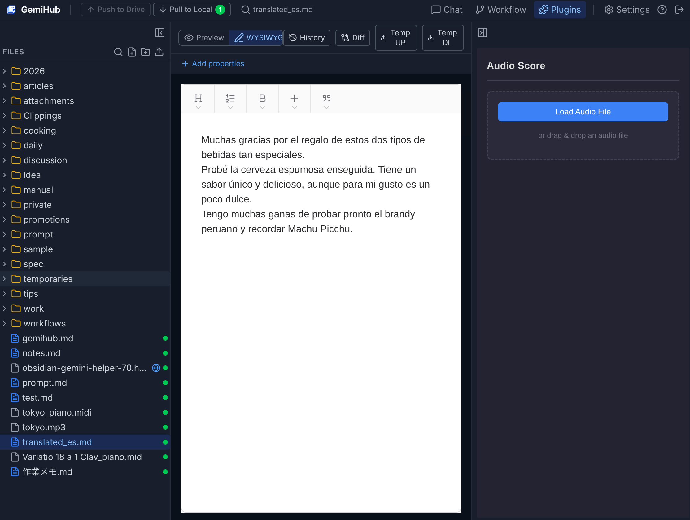
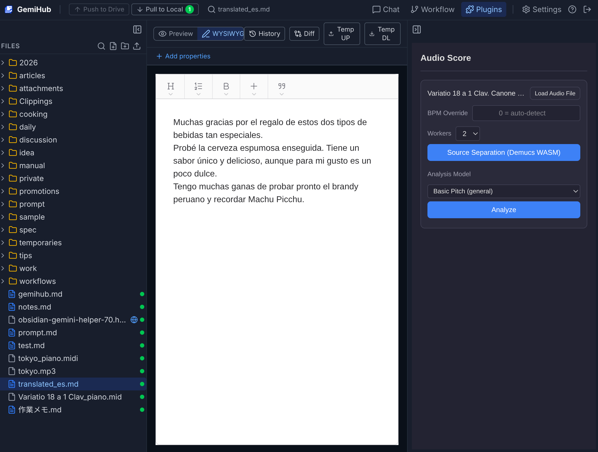
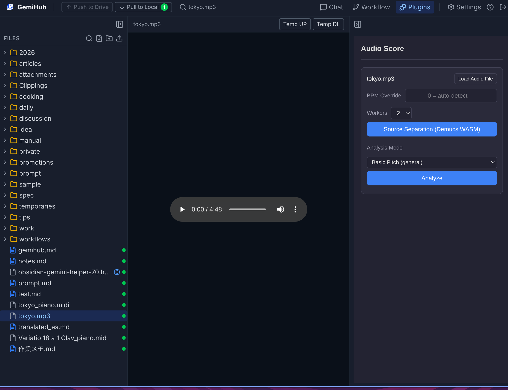
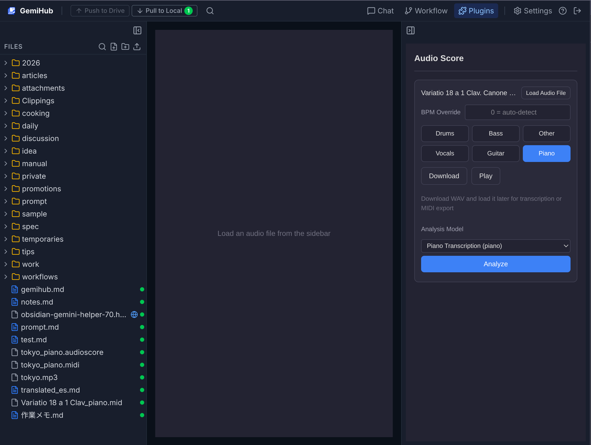
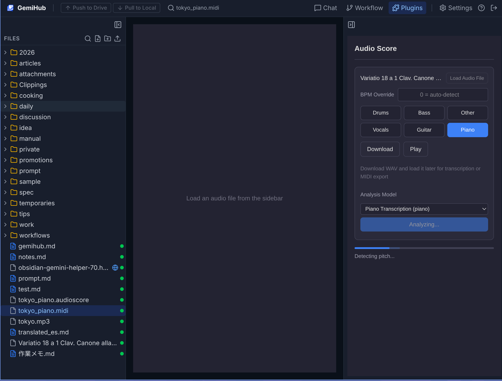
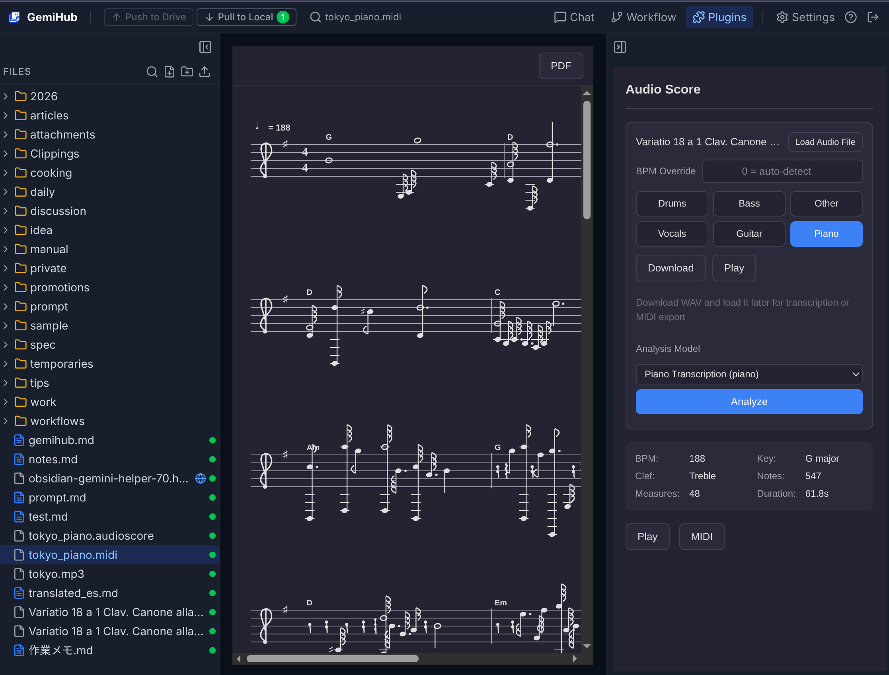
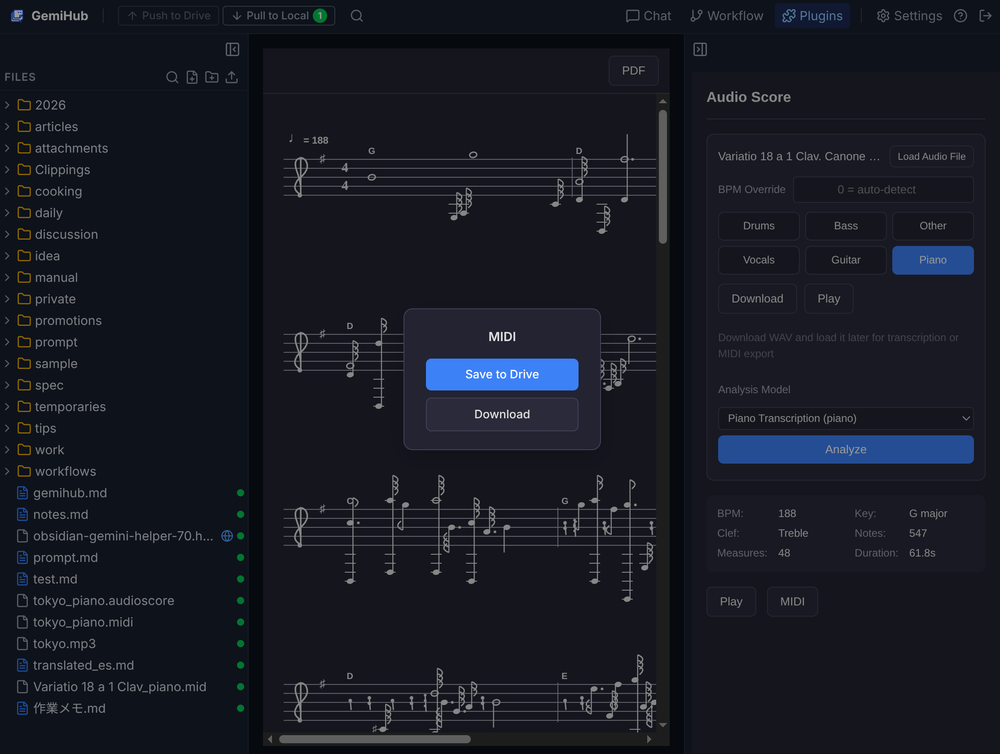
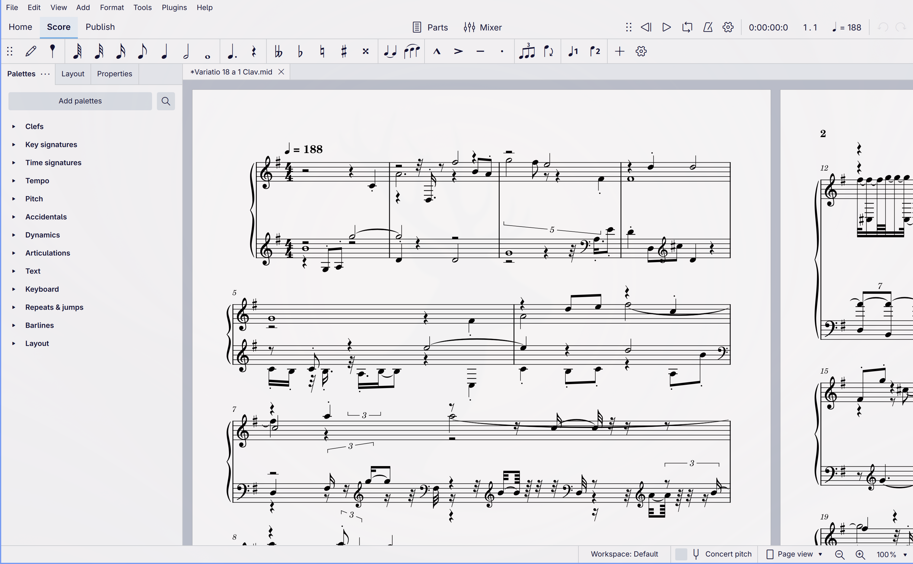

# Audio Score - Audio to Sheet Music

A [GemiHub](https://github.com/takeshy/gemihub) plugin that converts audio files into sheet music using ML-based pitch detection. Detected notes are rendered on a musical staff with playback support.

[Japanese / 日本語](README_ja.md)

## Features

- **Two pitch detection models**
  - **Basic Pitch** (Spotify) — general-purpose polyphonic detection via TensorFlow.js
  - **Piano Transcription** (ByteDance CRNN) — piano-optimized detection via ONNX Runtime Web WASM with parallel worker inference
- **Source separation** — Demucs WASM (htdemucs_6s) isolates individual stems (piano, vocals, bass, drums, guitar, other) before analysis
- **Automatic music analysis** — BPM detection, key signature (Krumhansl-Schmuckler), clef selection, beat quantization
- **Staff notation rendering** — canvas-based display with note heads, accidentals, ledger lines, and measure bars
- **Score playback** — play back detected notes via Web Audio API; click any measure to start from there; current measure is highlighted during playback
- **MIDI import** — open `.mid` / `.midi` files via file picker, drag & drop, or Drive to display as sheet music
- **Export** — MIDI (save to Drive or download), PDF, plain text score, stem WAV download
- **AI chord analysis** — automatic chord detection via Gemini after analysis (optional)
- **Bilingual UI** — English and Japanese

## Installation

1. Go to **Settings > Plugins** in GemiHub
2. Enter `takeshy/hub-audio-score`
3. Click **Install**

## Usage

1. Open the Audio Score panel in the GemiHub sidebar. When a non-audio file is selected, only the **Load Audio File** button is shown



2. Select an audio file in Drive — the source card with BPM override, source separation, and analysis model appears automatically



3. You can also open an audio file directly to see the audio player alongside the source card



4. Optionally run source separation to isolate stems (piano, vocals, etc.). When the piano stem is selected, Piano Transcription is auto-selected as the analysis model. Download separated WAV files for later transcription or MIDI export



5. Select a detection model and click **Analyze**



6. The score is displayed — play back, export PDF, or click a measure to start playback from there. Chord annotations are automatically added if Gemini is available



7. Click **MIDI** to export — choose **Save to Drive** or **Download**



8. Open the exported MIDI in [MuseScore Studio](https://musescore.org/) for beautifully engraved notation and high-quality piano playback. Audio Score is designed to be used together with MuseScore Studio for the best results



## Architecture

```
src/
├── main.ts                           # Plugin entry point
├── types.ts                          # Shared types (DetectedNote, ScoreData, etc.)
├── i18n.ts                           # Internationalization (en/ja)
├── core/
│   ├── basicPitchDetector.ts         # Spotify basic-pitch via TF.js CDN
│   ├── pianoTranscriptionService.ts  # ByteDance CRNN via ORT Web WASM
│   ├── demucsService.ts              # Demucs WASM source separation
│   ├── musicTheory.ts                # BPM, key, quantization, measures
│   ├── noteSegmenter.ts              # DetectedNote[] → ScoreData pipeline
│   ├── midiImport.ts                 # Standard MIDI File import parser
│   ├── midiExport.ts                 # Standard MIDI File export
│   ├── aiService.ts                  # Gemini AI (chord analysis)
│   ├── scoreParser.ts                # Score text format parser
│   └── player.ts                     # Web Audio playback
├── ui/
│   ├── ScorePanel.tsx                # Sidebar panel (controls + results)
│   ├── MainView.tsx                  # Main view (staff rendering)
│   ├── SettingsPanel.tsx             # Settings dialog
│   ├── ScoreRenderer.ts             # Canvas-based staff renderer
│   └── pdfExport.ts                 # PDF generation via jsPDF
└── storage/
    └── idb.ts                        # IndexedDB cache (models, temp data)
```

## Analysis Pipeline

1. **Decode** — Web Audio API decodes the input file
2. **Separate** (optional) — Demucs isolates the selected stem
3. **Detect** — Basic Pitch or Piano Transcription extracts notes
4. **BPM** — histogram-based inter-onset interval analysis
5. **Quantize** — snap start times to 32nd-note grid, durations to nearest musical value
6. **Key** — Krumhansl-Schmuckler algorithm on pitch class histogram
7. **Measures** — partition notes by time signature and downbeat offset
8. **Render** — draw on canvas staff with proper notation

## Settings

| Setting | Default | Description |
|---|---|---|
| Analysis Model | Basic Pitch | Basic Pitch (general) or Piano Transcription (piano) |
| Onset Threshold | 0.5 | Note onset sensitivity, Basic Pitch only (0-1) |
| Frame Threshold | 0.3 | Note presence sensitivity, Basic Pitch only (0-1) |
| Min Note Duration | 0.03s | Filter out notes shorter than this |
| Beats Per Measure | 4 | Time signature numerator |
| Beat Unit | 4 | Time signature denominator |
| BPM Override | 0 | Force BPM (0 = auto-detect) |
| Pitch Range | All | all / cut bass (C3+) / melody only (C4-C7) |
| Min Amplitude | 0 | Amplitude threshold (0 = off) |
| Source Separation | Off | Enable Demucs stem isolation |
| Separation Stem | Piano | Target stem: drums, bass, other, vocals, guitar, piano |

## External Assets

Large model files are hosted on GCS and downloaded on first use, then cached in IndexedDB.

| Asset | Size | Description |
|---|---|---|
| `demucs_onnx_simd.wasm` | ~5 MB | Demucs WASM binary (ORT minimal, SIMD) |
| `htdemucs_6s.ort.gz` | ~63 MB | Demucs model weights (gzip ORT FlatBuffer) |
| `piano_transcription.ort.gz` | ~134 MB | Piano transcription model (gzip ORT FlatBuffer) |

Basic Pitch model (~10 MB) and TensorFlow.js are loaded from public CDNs.

## Development

```bash
npm install
npm run dev      # Watch mode
npm run build    # Type-check + production bundle
npm test         # Run vitest
```

### Deploy

```bash
cp main.js styles.css manifest.json ~/pkg/gemihub/data/plugins/audio-score/
```

## Third-Party Licenses

This plugin uses the following third-party models and libraries:

| Component | Author | Code License | Model/Weights License |
|---|---|---|---|
| [Basic Pitch](https://github.com/spotify/basic-pitch) | Spotify | Apache 2.0 | Apache 2.0 |
| [Piano Transcription](https://github.com/bytedance/piano_transcription) | ByteDance | MIT | CC BY 4.0 |
| [Demucs / htdemucs](https://github.com/adefossez/demucs) | Meta (Facebook Research) | MIT | Research use only |
| [ONNX Runtime Web](https://github.com/microsoft/onnxruntime) | Microsoft | MIT | — |
| [TensorFlow.js](https://github.com/tensorflow/tfjs) | Google | Apache 2.0 | — |

**Note:** The Demucs model weights (htdemucs_6s) are trained on MUSDB18-HQ and are intended for research purposes only. The Piano Transcription model weights are licensed under CC BY 4.0 and require attribution to ByteDance.

## License

MIT
